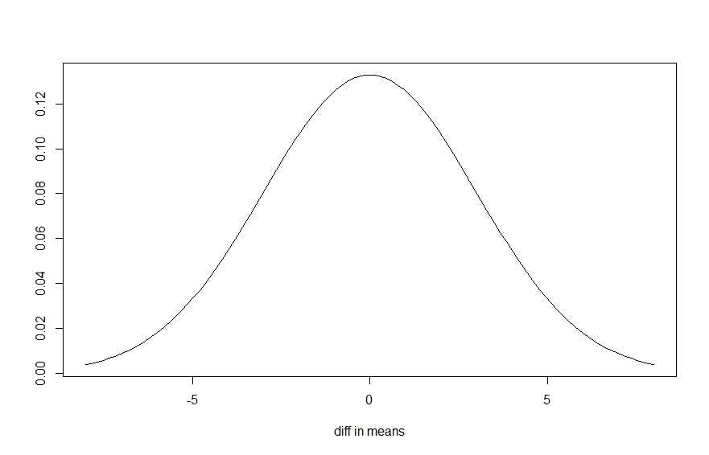
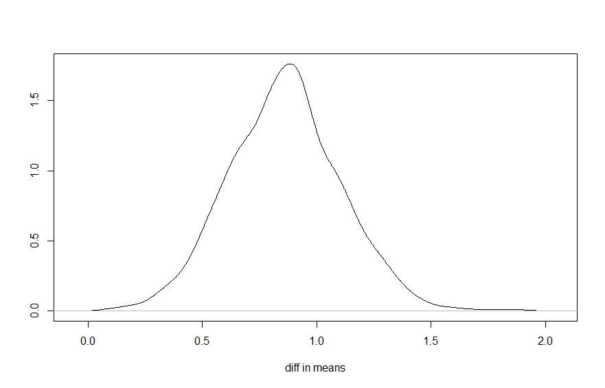
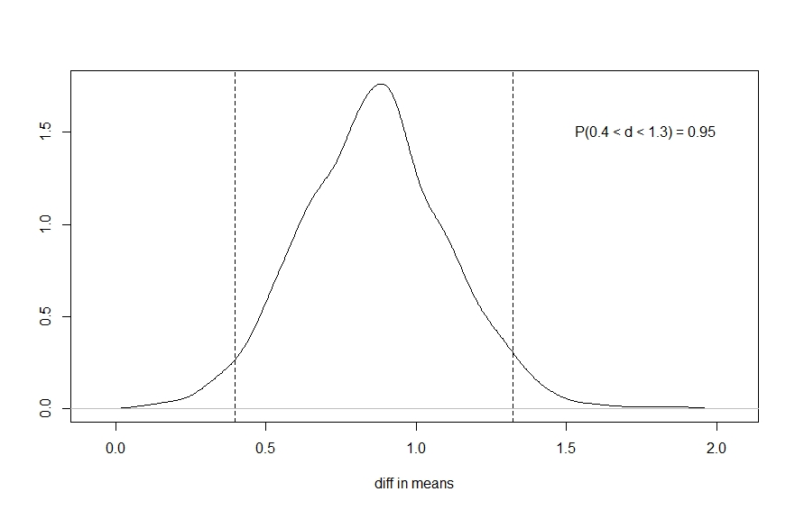

```{r setup, include=FALSE}
knitr::opts_chunk$set(echo = TRUE, out.width = '90%')
```

## Agenda

- Review some basic concepts from Part 1
- Implement more complex Bayesian analyses
- model visualization


## Review: Bayesian statistics

* The objective of a Bayesian analysis is a _posterior distribution_ of our parameters of interest
* To obtain a posterior distribution, we must start with a _prior distribution_ and a _likelihood_
* Using _Markov chain Monte Carlo (MCMC)_ we sample from the prior and likelihood to estimate the posterior distributions
* The `rstanarm` package allows us to perform common Bayesian analyses without having to learn Stan

## Review: Example

Examine two brands of rechargeable batteries. How long do they run (in hours) before exhausted? Take 25 samples of each brand and calculate mean time to exhaustion for each brand.

* begin with a _prior_ distribution of how we believe the difference in means might be distributed
* update the prior distribution using the _likelihood_ of the data we collected to obtain a _posterior_ distribution
* use the posterior distribution to describe the differences in brands

## Review: a prior distribution

Perhaps we're not sure which brand is better. A possible prior distribution might look like this, a $N(0,3)$ distribution.




## Review: a posterior distribution

After observing our data we use _Bayes' theorem_ to update our prior distribution to get a posterior distribution.




## Review: using posterior distribution

The probability the difference is between 0.4 and 1.3 is about 0.95.



## Review: Implementation


```{r echo=FALSE, message=FALSE}
library(rstanarm)
bat <- read.csv("data/batteries.csv")
bmod <- readRDS("rds/bmod2.Rds")
```


```{r eval=FALSE}
library(rstanarm)
bmod <- stan_glm(y ~ grp, data = bat, 
                   family = gaussian,   
                   prior = normal(0,3))
```

Bayesian uncertainty interval estimated from the posterior distribution:

```{r}
round(posterior_interval(bmod, prob = 0.95, 
                         pars = "grp"),2)

```


## Review: plotting posterior distribution

```{r}
plot(bmod, plotfun = "dens", pars = "grp") 
```

## Review: Working with posterior distribution

Let's say we want to estimate the probability that the difference in battery life is:

- greater than 0 
- greater than 1 hour

`as.data.frame()` creates a data frame of _posterior samples_. 

```{r}
post <- as.data.frame(bmod)
mean(post$grp > 0)
mean(post$grp > 1)
```


## Review: graphical posterior predictive checks

```{r}
pp_check(bmod)
```


## Moving on to more complex analyses

The previous example was a simple _model_ with one predictor. It was essentially the Bayesian approach to what is traditionally analyzed as a t test. 

Today's workshop will cover more complicated analyses including:

- multiple regression
- regression with interactions
- binary logistic regression


## Multiple regression

Multiple regression, or linear modeling, is the idea that the variability of some numeric variable of interest can be "explained" by a sum of weighted predictors. 

Example: patient satisfaction scores at a hospital. Some are high, some are low. Why? Perhaps it has do with their age, anxiety level, and illness severity.

$$\text{satisfaction} = \beta_0 + \beta_1 \text{age} + \beta_2 \text{anxiety} + \beta_3 \text{illness}$$

Where the betas represent some _weight_. Hence the term, _weighted sum_. $\beta_0$ is the intercept.

## Multiple regression

$$\text{satisfaction} = \beta_0 + \beta_1 \text{age} + \beta_2 \text{anxiety} + \beta_3 \text{illness}$$

This model says, "if I take age, anxiety level and illness severity, multiply each by some weight, and add them up, I'll get an expected patient satisfaction score."

The calculated value will be off by some amount. We assume this amount, usually denoted $\epsilon$, is a random draw from a Normal distribution with mean 0 and some unknown standard deviation, $\sigma$. This gives us

$$\text{satisfaction} = \beta_0 + \beta_1 \text{age} + \beta_2 \text{anxiety} + \beta_3 \text{illness} + \epsilon$$

Traditional multiple regression means estimating the betas and $\sigma$.

## Using `lm`

The traditional approach in R uses the `lm` function.

```{r}
ps <- read.csv("data/patient_satisfaction.csv")
m <- lm(ps ~ age + illness + anxiety, data = ps)
```

The betas (coefficients/weights) and $\sigma$ can be viewed with `coef` and `sigma`

```{r}
coef(m)
sigma(m)
```


## Using `glm`

We can also use `glm` for multiple regression. Note the `family` argument which allows us to specify the error distribution. 

```{r}
m2 <- glm(ps ~ age + illness + anxiety, data = ps, 
          family = gaussian)
coef(m2)
sigma(m2)

```


## The Bayesian approach

As before, instead of estimating parameters, the Bayesian approach is to **estimate the distributions of parameters**.

We propose a prior distribution for the betas and $\sigma$, and update those distributions using a likelihood and the data.

## Likelihood

Recall our model:

$$\text{satisfaction} = \beta_0 + \beta_1 \text{age} + \beta_2 \text{anxiety} + \beta_3 \text{illness} + \epsilon$$

where $\epsilon \sim N(0,\sigma)$

This implies

$$\text{satisfaction} \sim N(\beta_0 + \beta_1 \text{age} + \beta_2 \text{anxiety} + \beta_3 \text{illness}, \sigma)$$

This is our _likelihood_: A normal, or Gaussian, distribution with a _conditional_ mean that changes based on age, anxiety and illness.

Where traditional statistics maximizes likelihood, Bayesian statistics multiplies the likelihood by the prior to get a posterior distribution.

## Using `stan_glm`

```{r echo=FALSE}
bm <- readRDS("rds/ps_bm1.Rds")
```


The `stan_glm` function uses the same syntax as `glm` and provides _weakly informative_ default prior distributions.[^1]

```{r eval=FALSE}
bm <- stan_glm(ps ~ age + illness + anxiety, 
               data = ps,
               family = gaussian)

```

Instead of point estimates for the betas and $\sigma$, we get posterior distributions.

[^1]: On startup, rstanarm states "Default priors may change, so it's safest to specify priors, even if equivalent to the defaults."

## Using `stan_glm` with explicit priors

Use the `prior` arguments to specify priors. Below are the default priors. The `normal` and `exponential` functions are from `rstanarm`.

```{r eval=FALSE}
bm <- stan_glm(ps ~ age + illness + anxiety, 
               data = ps,
               family = gaussian,
               prior_intercept = normal(mean(ps$ps),10),
               prior = normal(c(0,0,0),c(2.5,2.5,2.5)),
               prior_aux = exponential(1))

```

The scale, or spread, of the priors is automatically rescaled to accommodate the range of the data.


## Evaluating and exploring the model

We proceed the same way as before to evaluate and explore the model.

```{r eval=FALSE}
plot(bm, plotfun = "dens")
posterior_interval(bm)
summary(bm)
pp_check(bm)

```

Let's go to R!

## Models with interactions

In our previous model, we assumed the predictor effects were simply additive. For example, it didn't matter how ill you were, the effect of age was always the same.

$$\text{satisfaction} = \beta_0 + \beta_1 \text{age} + \beta_2 \text{anxiety} + \beta_3 \text{illness}$$

But we may have reason to believe the effects of age and illness interact. Perhaps the older you are, the effect of illness on patient satisfaction decreases.

One way to describe this interaction is to add the product of age and illness to the model:

$$\text{satisfaction} = \beta_0 + \beta_1 \text{age} + \beta_2 \text{anxiety} + \beta_3 \text{illness} + \beta_4 \text{age} \times \text{illness}$$

## Specifying interactions

Use a colon to specify interactions in the model syntax.

```{r eval=FALSE}
bm2 <- stan_glm(ps ~ age + illness + anxiety +
                    age:illness, 
               data = ps,
               family = gaussian)

```

Or use the asterisk as a shortcut: `age * illness` = `age + illness + age:illness`

## The modeling result

```{r echo=FALSE}
bm2 <- readRDS("rds/ps_bm2.rds")
```

Once again the target of the Bayesian model is the collection of posterior distributions on the model weights, or coefficients.

```{r}
posterior_interval(bm2)
```

The interaction appears to be small and we're uncertain whether it's positive or negative. 

## The modeling result

The `coef` function returns the medians of the posterior distributions of the coefficients.[^2]

```{r}
as.matrix(coef(bm2))
```

[^2]: Using `as.matrix` to force the coefficients into a column so they will fit on the slide. 

## Visualizing interactions

Even if we had good evidence that the coefficient for an interaction was large and in a certain direction (positive or negative), the coefficient can be hard to interpret.

To aid in interpretation we can use _effect plots_ to help us visualize our models.

The basic idea is to generate predictions for various combinations of predictors and plot the result.

## Using `ggeffects` to create effect plots

The `ggeffects` package provides methods for easily creating effect plots for models created with `rstanarm`.

The basic syntax to quickly generate an effect plot for our interaction:

```{r eval=FALSE}
library(ggeffects)
ggpredict(bm2, terms = c("age","illness")) |> 
  plot()
```

The following plot shows that the interaction between age and illness is small and virtually non-existent.

## An effect plot for the `age:illness` interaction

```{r message=FALSE, echo=FALSE}
library(ggeffects)
ggpredict(bm2, terms = c("age","illness")) |> 
  plot()
```


## Customizing the effect plot

By default ggpredict will pick some values for the 2nd term. We can specify values if we like as follows:

```{r eval=FALSE}
ggpredict(bm2, terms = c("age","illness[45,50,55]")) |>
  plot()
```

If we want illness on the x-axis:

```{r eval=FALSE}
ggpredict(bm2, terms = c("illness","age[30,40,50]")) |>
  plot()
```

## An effect plot for the `age:illness` interaction

```{r message=FALSE}
ggpredict(bm2, terms = c("illness","age[30,40,50]")) |>
  plot()
```

## Interpreting interactions in effect plots

On the previous slide, the effect of illness on patient satisfaction appeared to be the same regardless of age. The plotted lines were approximately parallel. This indicates a small or negligible interaction. 

If the plotted lines had vastly different trajectories such that they crossed or grew further apart, then we would have evidence of an interaction. 


## Effect plots for main effects

Effect plots are useful for main effects as well (ie, predictors not involved in an interaction)

```{r fig.height=5}
ggpredict(bm2, terms = "anxiety") |> plot()
```

The 95% credibility ribbon is for the _mean_ response value.

## Effect plots for main effects

Set `ppd = TRUE` to get a prediction interval.

```{r fig.height=5}
ggpredict(bm2, terms = "anxiety", ppd = TRUE) |> plot()
```

The 95% credibility ribbon is for the _predicted_ response value. Let's go to R!


## Logistic regression

Logistic regression models the probability of a binary outcome. The dependent variable is often of the form 0/1, failure/success or no/yes.

Like multiple regression, we model probability as a weighted sum of predictors. 

Unlike multiple regression, there is no $\sigma$ and the weighted sum of predictors are embedded in the _logistic_ function:

$$P(Y=1) = \frac{1}{1 + \text{exp}(-X\beta)}$$

where $X\beta = \beta_0 + \beta_1X_1 + \beta_2X_2 + \ldots + \beta_kX_k$ 

This ensures our model always returns values between 0 and 1.

## The logit transformation

We can express the logistic regression model as a simple weighted sum of predictors by using the _logit_ transformation:

$$\text{log} \left( \frac{P(Y = 1)}{1 - P(Y = 1)} \right) = \beta_0 + \beta_1X_1 + \ldots + \beta_kX_k$$

In this transformation, the response and coefficients are on the _log odds_ scale.

This is the form logistic regression takes when performed in R (or any other program).


## Likelihood

Since we're modeling the probability of an event happening, our response variable has a binomial distribution with _n_ = 1:

$$Y \sim B\left(n = 1, p = \frac{1}{1 + \text{exp}(-X\beta)} \right)$$

While traditional statistics maximizes this likelihood, Bayesian statistics multiplies the likelihood by the prior to get a posterior distribution. 


## Logistic regression example

A clinical trial investigates a new treatment for rheumatoid arthritis. Model probability of seeing improvement in condition based on treatment, sex, and age. 

```{r echo=FALSE}
arthritis <- readRDS("rds/arthritis.rds")
set.seed(1)
i <- sample(nrow(arthritis))
arthritis <- arthritis[i,]
rownames(arthritis) <- NULL
```

```{r}
head(arthritis)
```


$$\text{log} \left( \frac{P(\text{Better} = 1)}{1 - P(\text{Better} = 1)} \right) = \beta_0 + \beta_1\text{Trt} + \beta_2\text{Sex} + \beta_3\text{Age}$$


## Fitting the model

The traditional method uses `glm`. Notice we set `family = binomial` since our response is binary.

```{r eval=FALSE}
glm1 <- glm(Better ~ Treatmnt + Sex + Age, 
            data = arthritis,
            family = binomial)
```

The `rstanarm` specification is virtually identical, except we use `stan_glm`

```{r eval=FALSE}
bglm1 <- stan_glm(Better ~ Treatment + Sex + Age, 
                  data = arthritis,
                  family = binomial)

```

The default coefficient priors are the same as those used when performing multiple regression. The intercept has location = 0.

## Interpreting the coefficients

Recall Bayesian modeling does not return point estimates for the coefficients (the betas) but rather distributions. To get a coefficient value, we typically take the median or the mean of the posterior distribution.

The `coef` function returns the median values.

```{r echo=FALSE}
bglm1 <- readRDS(file = "rds/bglm1.rds")
```

```{r}
coef(bglm1)
```


Exponentiating the coefficient value returns an odds ratio.

The odds that `Better = 1` is about 6 times higher for the Treated group: $\text{exp}(1.74) \approx 5.7$

## Using effect plots with logistic regression models

An effect plot can help communicate a model in terms of probability.

```{r fig.height=5}
ggpredict(bglm1, terms = "Treatment") |> plot()
```

Let's go to R!

## Some journal articles using `rstanarm`

Espe, M. et al. (2016) Yield gap analysis of US rice production systems shows opportunities for improvement. _Field Crops Research_, 196:276-283. 

Kubrak, O. et al. (2017) Adaptation to fluctuating environments in a selection experiment with Drosophila melanogaster. _Ecology and Evolution_, 7:3796-3807.

Herzog, S. et al. (2017) Sun Protection Factor Communication of Sunscreen Effectiveness. _JAMA Dermatology_, 153(3):348-350.

Kovic, M. and Hänsli, N. (2017) The impact of political cleavages, religiosity, and values on attitudes towards nonprofit organizations. _Social Sciences_, 7(1), 2.


## References

McElreath, M. (2016). _Statistical Rethinking_. CRC Press. Boca Raton.

Muth, C., Oravecz, Z., & Gabry, J. (2018). User-friendly Bayesian regression modeling: A tutorial with rstanarm and shinystan. _The Quantitative Methods for Psychology_, 14(2), 99-119.

Nicenboim, B., Schad, D. , and Vasishth, S. (2021) An Introduction to Bayesian Data Analysis for Cognitive Science. https://vasishth.github.io/bayescogsci/book/

`rstanarm` web site: http://mc-stan.org/rstanarm/


